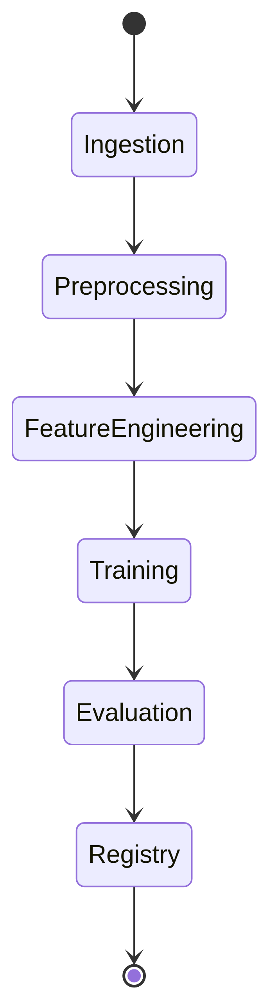
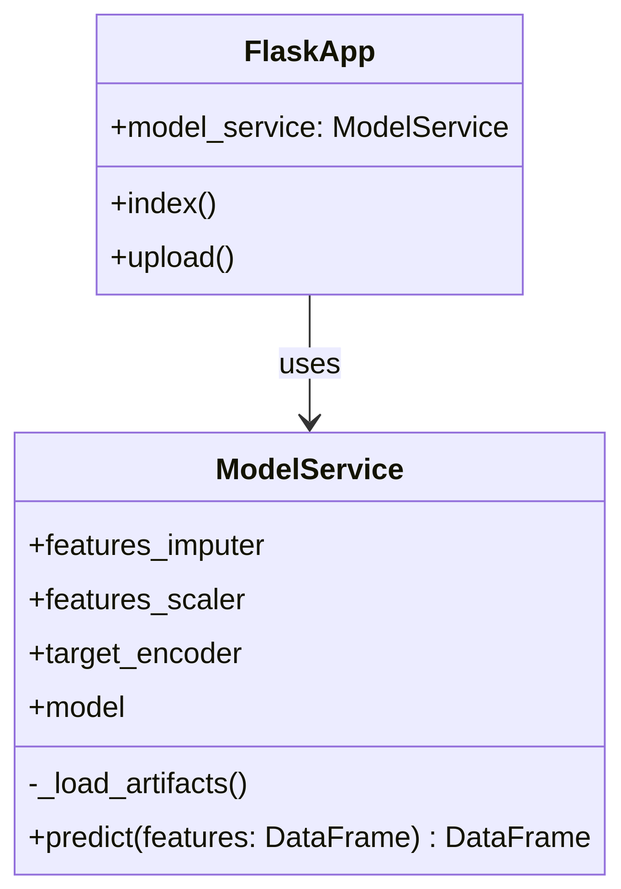
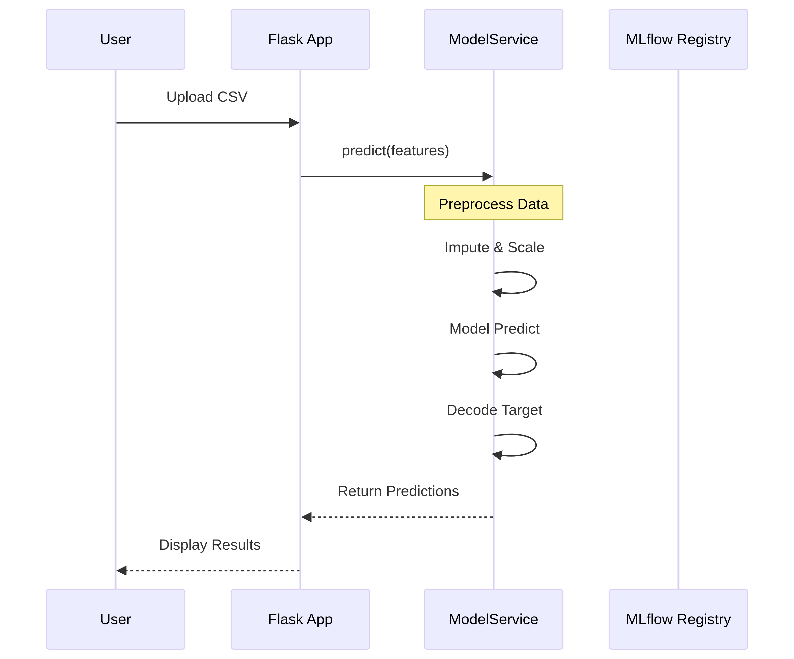

# MLOps Pipeline: Breast Cancer Classifier


Este projeto implementa um pipeline completo de Machine Learning (End-to-End) do dataset nativo Breast Cancer. O objetivo é demonstrar práticas modernas de **MLOps**, garantindo reprodutibilidade, versionamento de dados e orquestração automatizada.

---

## Arquitetura do Pipeline

O pipeline é orquestrado pelo **Apache Airflow** e gerencia o ciclo de vida dos dados usando **DVC**.

### Etapas do Pipeline:
1.  **Ingestion (`dvc_load_data`)**: Carregamento dos dados brutos versionados.
2.  **Preprocessing (`dvc_preprocess_data`)**: Limpeza e normalização de texto (NLP).
3.  **Feature Engineering (`dvc_engineer_features`)**: Transformação de dados (TF-IDF/Embeddings).
4.  **Training (`dvc_train_model`)**: Treinamento do modelo (Random Forest/XGBoost).
5.  **Evaluation (`dvc_evaluate_model`)**: Geração de métricas e validação.
6.  **Registry (`register_artifacts`)**: Log de modelos e métricas no MLflow.

---

## Tecnologias Utilizadas

*   **Linguagem:** Python 3.12
*   **Gerenciamento de Dependências:** Poetry
*   **Versionamento de Dados:** DVC (Data Version Control), DAGSHUB (repositório para versionamento dos dados)
*   **Orquestração:** Apache Airflow (Standalone Mode)
*   **Rastreamento de Experimentos:** MLflow (Integrado via DAG)
*   **Bibliotecas de ML:** Scikit-learn, Pandas, Tensorflow, NumPY.

---

## Como Rodar o Projeto

### 1. Pré-requisitos
Certifique-se de ter instalado:
*   Git
*   Python 3.12+
*   Poetry (`pip install poetry`)

### 2. Instalação
Clone o repositório e instale as dependências:

```bash
git clone https://github.com/Code-AldreySandre/MLOPS_Project.git
cd MLOPS_Project

# Instala todas as libs do pyproject.toml
poetry install
```
### 3. Configuração do Airflow (Standalone)
Este projeto utiliza uma estrutura customizada onde o Airflow reside dentro da pasta raiz.
```bash
# 1. Defina a variável de ambiente (Crucial!)
export AIRFLOW_HOME=$(pwd)/airflow_home

# 2. Inicialize o Airflow no modo Standalone (DB + Scheduler + Webserver)
poetry run airflow standalone
```
-**obs:** Ao rodar pela primeira vez, o terminal exibirá a senha do usuário admin. Essa senha também fica salva em airflow_home/standalone_admin_password.txt.

### 4. Acessando a Interface
- Abra o navegador em: **http://localhost:8080**

- Faça login com admin e a senha gerada.

- Busque pela DAG: **ml_pipeline_project**.

- Ative o toggle (Unpause) e clique em ▶️ Trigger DAG.

---
## Estrutura do Projeto
```bash
MLOPS_Project/
├── airflow_home/       # Configurações e Logs do Airflow (Local)
├── dags/               # Definição dos Pipelines (DAGs)
│   └── ml_pipeline_dag.py
├── data/               # Dados versionados pelo DVC (ignorados no git)
├── src/                # Código fonte do projeto
│   ├── DataLoading/    # Módulo de carregamento de dados
│   ├── DataPreprocessing/ # Módulo de pré-processamento
│   ├── FeatureEnginnering/ # Módulo de engenharia de features
│   ├── ModelTraining/  # Módulo de treinamento
│   ├── ModelEvaluation/ # Módulo de avaliação
│   └── register_artifacts.py # Script de registro no MLflow
├── app/                # Aplicação Flask para Model-as-a-Service
├── dvc.yaml            # Definição dos estágios do DVC
├── dvc.lock            # Hash exato dos dados e modelos (Reprodutibilidade)
├── pyproject.toml      # Dependências do Poetry
└── README.md           # Este arquivo
```

---
## Documentação Técnica

### 1. Arquitetura da Rede Neural (Modelo de Classificação)

O projeto utiliza uma **Rede Neural Densa (DNN)** implementada com **TensorFlow/Keras** para a classificação binária (Benigno/Maligno) do dataset Breast Cancer. A arquitetura é definida de forma modular e parametrizada via `params.yaml`.

| Camada | Tipo | Neurônios | Função de Ativação | Parâmetro (params.yaml) |
| :--- | :--- | :--- | :--- | :--- |
| Entrada | Densa | Variável (30) | ReLU | - |
| Oculta 1 | Densa | 64 | ReLU | `hidden_layer_1_neurons` |
| Dropout 1 | Dropout | - | - | `dropout_rate` (0.3) |
| Oculta 2 | Densa | 32 | ReLU | `hidden_layer_2_neurons` |
| Dropout 2 | Dropout | - | - | `dropout_rate` (0.3) |
| Saída | Densa | 2 | Softmax | - |

O modelo é compilado com o otimizador **Adam** e a função de perda **`categorical_crossentropy`**.

### 2. Padrões de Projeto de MLOps

O projeto aplica padrões essenciais para garantir a robustez e a governança do modelo:

| Padrão de Projeto | Implementação no Projeto |
| :--- | :--- |
| **Modularidade** | Separação do código em módulos lógicos (`src/`). |
| **Injeção de Dependência (Configuração)** | Uso do `params.yaml` para gerenciar hiperparâmetros. |
| **Model Registry Pattern** | Uso do **MLflow Registry** para versionar e promover modelos entre estágios. |
| **Pipeline Orchestration** | Uso do **Apache Airflow** para automatizar o fluxo de trabalho. |

### 3. Diagramas Arquiteturais

Os diagramas de arquitetura e fluxo de trabalho estão disponíveis na pasta `imgs/`:

*   **Diagrama de Implantação:** Ilustra a arquitetura de alto nível (Cliente, Servidor, Infraestrutura MLOps).


*   **Diagrama de Atividade (Pipeline MLOps):** Representa o fluxo de trabalho automatizado (Ingestion -> Training -> Registry).


*   **Diagrama de Classe (Aplicação de Serviço):** Detalha a estrutura da aplicação Flask e do serviço de modelo.


*   **Diagrama de Sequência (Fluxo de Predição):** Descreve o fluxo de dados durante a inferência do modelo.

### 4. Dicionário de Dados (Dataset Breast Cancer)

O projeto utiliza o dataset Breast Cancer Wisconsin (Diagnostic) [1], que contém 30 atributos de características nucleares.

| Coluna | Tipo | Descrição |
| :--- | :--- | :--- |
| **Target** | Categórica (0, 1) | Rótulo de classificação: **0** (Maligno) ou **1** (Benigno). |
| **mean radius** | Numérica | Média das distâncias do centro aos pontos do perímetro. |
| **mean texture** | Numérica | Desvio padrão dos valores de escala de cinza. |
| **mean perimeter** | Numérica | Média do perímetro do núcleo. |
| **mean area** | Numérica | Média da área do núcleo. |
| **mean smoothness** | Numérica | Média da variação local nos comprimentos dos raios. |
| **mean compactness** | Numérica | Média de $\frac{Perímetro^2}{Área} - 1.0$. |
| **mean concavity** | Numérica | Média da gravidade das porções côncavas do contorno. |
| **mean concave points** | Numérica | Média do número de porções côncavas do contorno. |
| **mean symmetry** | Numérica | Média da simetria do núcleo. |
| **mean fractal dimension** | Numérica | Média da aproximação da "complexidade" do contorno. |
| **...** | **...** | **...** |
| **worst radius** | Numérica | "Pior" ou maior valor para o raio. |
| **worst texture** | Numérica | "Pior" ou maior valor para a textura. |
| **worst perimeter** | Numérica | "Pior" ou maior valor para o perímetro. |
| **worst area** | Numérica | "Pior" ou maior valor para a área. |
| **worst smoothness** | Numérica | "Pior" ou maior valor para a suavidade. |
| **worst compactness** | Numérica | "Pior" ou maior valor para a compacidade. |
| **worst concavity** | Numérica | "Pior" ou maior valor para a concavidade. |
| **worst concave points** | Numérica | "Pior" ou maior valor para os pontos côncavos. |
| **worst symmetry** | Numérica | "Pior" ou maior valor para a simetria. |
| **worst fractal dimension** | Numérica | "Pior" ou maior valor para a dimensão fractal. |

### 5. Métricas de Avaliação

As métricas são calculadas no conjunto de teste e logadas no MLflow e DVC.

| Métrica | Descrição |
| :--- | :--- |
| **Acurácia (Accuracy)** | Proporção de previsões corretas (geral). |
| **F1-Score Ponderado** | Média harmônica ponderada da precisão e *recall*. |
| **Precisão Ponderada** | Proporção de identificações positivas corretas, ponderada pelo suporte. |
| **Recall Ponderado** | Proporção de positivos reais que foram corretamente identificados, ponderada pelo suporte. |
| **Matriz de Confusão** | Tabela que descreve o desempenho do modelo. |

---
## Segurança e Boas Práticas

- **Credenciais:** Senhas e chaves de API não são versionadas (via .gitignore).

- **Dados:** Apenas os arquivos .dvc sobem para o GitHub; os dados reais ficam no armazenamento remoto (S3/DagsHub).

---
## Referências

[1] Breast Cancer Wisconsin (Diagnostic) Dataset. *Scikit-learn*. Disponível em: [https://scikit-learn.org/stable/modules/generated/sklearn.datasets.load_breast_cancer.html](https://scikit-learn.org/stable/modules/generated/sklearn.datasets.load_breast_cancer.html)